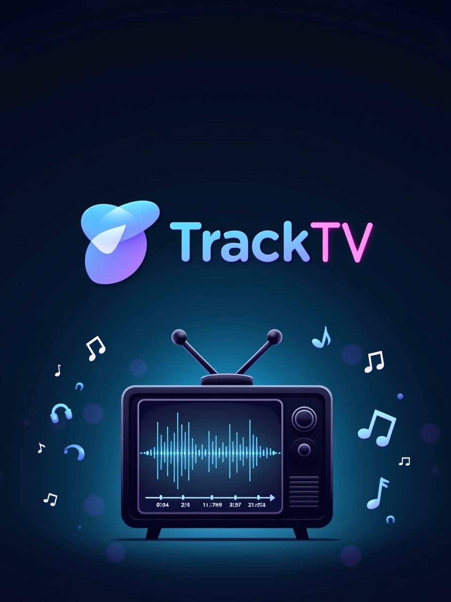

# TrackTV

> *A data-driven exploration of how soundtracks shape emotion in iconic TV series.*

---

## Overview
TrackTV is a personal data engineering project that analyzes the emotional and narrative impact of TV series soundtracks — episode by episode, moment by moment.

This pipeline combines open APIs, web scraping, and modern tools to process and visualize how music contributes to audience engagement and storytelling.

---

## Series Covered
- **Grey's Anatomy** (pilot)
- **One Tree Hill** (emotional foundation)
- **Gossip Girl** (aesthetic & status-driven sound)

---

## Stack
- **Language:** Python 3.10+
- **Data Collection:** requests, BeautifulSoup, Spotipy
- **Database:** PostgreSQL (via Docker)
- **Orchestration:** Apache Airflow
- **Modeling & Transformation:** dbt
- **Visualization:** Streamlit
- **Deployment:** Docker Compose, GitHub

---

## Pipeline Flow
1. **Ingestion**
   - Episode metadata from Wikipedia/IMDb
   - Soundtrack data from Tunefind / Spotify
2. **Enrichment**
   - Audio features from Spotify API (valence, BPM, genre)
3. **Storage**
   - Raw and enriched data stored in PostgreSQL
4. **Transformation**
   - dbt models (staging, intermediate, mart)
5. **Exploration**
   - Analysis of trends per episode, emotion, and audience rating

---

## Personal Motivation
> This project is my way of bringing together two parts of who I am: the data engineer and the girl who grew up with a soundtrack for every moment. Every piece of code here is personal.

---

## Status
**In progress.** Check-ins posted daily.

---

## License
MIT

---

## Credits
Made by [Aline Silveira](https://www.linkedin.com/in/alinedsr/) with love, logic and looping playlists.

---

**#TrackTV #DataEngineering #SoundtrackAnalytics #PythonProject #Portfolio**